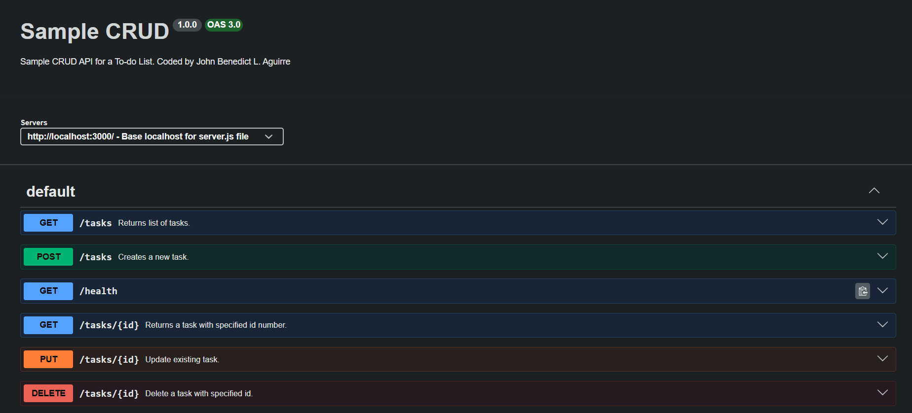

# FlyRank-BE-W2A1
First CRUD API Assignment for FlyRank Backend Internship

This repo contains a sample CRUD API for a to-do list where a user can view, create, update, or delete a task. SwaggerUI is also included to provide a GUI for testing the different endpoints of the API.

## Installation Instructions

# Installation

1. **Clone the repository**
   ```bash
   git clone <repo-url>
   ```

2. **Navigate to the project folder**
   ```bash
   cd FlyRank-BE-W2A1
   ```

3. **Install dependencies**
   ```bash
   npm i
   ```

4. **Start the server**
   ```bash
   node server.js
   ```

5. **Open in browser**
   - App: http://localhost:3000
   - Swagger UI: http://localhost:3000/docs

## Table of Endpoints

| Method | Path | Summary | Success | Errors |
|--------|------|---------|---------|--------|
| GET | `/tasks` | Returns list of tasks | 200 | — |
| POST | `/tasks` | Creates a new task | 201 | — |
| GET | `/health` | Returns server status | 200 | — |
| GET | `/tasks/{id}` | Returns task by id | 200 | — |
| PUT | `/tasks/{id}` | Update existing task | 200 | 400, 404 |
| DELETE | `/tasks/{id}` | Delete task by id | 204 | 404 |

## Sample `curl` output

For Windows CMD:
```bash
curl -i -X POST http://localhost:3000/tasks -H "Content-Type: application/json" -d "{\"title\":\"Buy milk\"}"
```

For Linux\macOS:
```bash
curl -i -X POST http://localhost:3000/tasks -H "Content-Type: application/json" -d '{"title":"Buy milk"}'
```

Response after running ```curl -i``` command:
```bash
HTTP/1.1 201 Created
X-Powered-By: Express
Content-Type: application/json; charset=utf-8
Content-Length: 40
ETag: W/"28-PpSBYV7i68cXyGc7AhjVpkZkY5Q"
Date: Sat, 19 Sep 2026 10:45:52 GMT
Connection: keep-alive
Keep-Alive: timeout=5

{"id":4,"title":"Buy milk","done":false}
```

## SwaggerUI Preview

